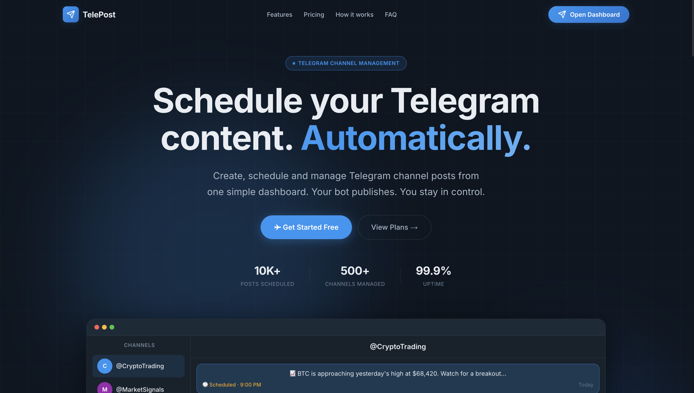

<h1 align="center">TelePost</h1>
<p align="center">
  
</p>

<p align="center">
  <strong>Schedule your Telegram content. Automatically.</strong>
</p>

<p align="center">
  Plan, schedule, and publish posts to your Telegram channels without being online.
</p>

<p align="center">
  <a href="https://github.com/AyushPanditmoto/TelePost">
    
  </a>
  <a href="https://github.com/AyushPanditmoto/TelePost">
    
  </a>
  
  
</p>

<br>

<p align="center">
  <a href="#-features">Features</a>
  &nbsp;&nbsp;•&nbsp;&nbsp;
  <a href="#-how-it-works">How It Works</a>
  &nbsp;&nbsp;•&nbsp;&nbsp;
  <a href="#-tech-stack">Tech Stack</a>
  &nbsp;&nbsp;•&nbsp;&nbsp;
  <a href="#-getting-started">Getting Started</a>
</p>

---

## ✨ What is TelePost?

**TelePost** is a Telegram content scheduling platform built for creators, businesses, communities, and channel owners.

Instead of manually opening Telegram every time you need to publish something, create your content once, choose a date and time, and let TelePost handle the rest.

> **Create → Schedule → Relax → TelePost publishes it.**

---

## 🚀 Features

<table>
<tr>
<td width="50%">

### 📅 Smart Scheduling

Schedule Telegram posts for a specific date and time.

</td>
<td width="50%">

### 🤖 Automatic Publishing

TelePost publishes your scheduled content automatically.

</td>
</tr>

<tr>
<td>

### 🔐 Telegram Login

Sign in quickly using your Telegram account.

</td>
<td>

### 📢 Channel Management

Connect and manage your Telegram channels from one dashboard.

</td>
</tr>

<tr>
<td>

### ✏️ Edit Scheduled Posts

Change scheduled content before it gets published.

</td>
<td>

### ⚡ Fast Dashboard

Simple and lightweight interface designed for quick content management.

</td>
</tr>
</table>

---

## 🎯 Why TelePost?

Managing an active Telegram channel can become repetitive.

You might have content ready at:

```text
09:00 AM  → Morning Update
01:00 PM  → Educational Post
05:00 PM  → Market Update
09:00 PM  → Daily Recap
```

Instead of setting reminders and manually posting everything, TelePost lets you prepare everything in advance.

### Your workflow becomes:

```text
       Create Content
             │
             ▼
        Choose Time
             │
             ▼
          Schedule
             │
             ▼
      ┌─────────────┐
      │   TelePost  │
      └─────────────┘
             │
             ▼
      Telegram Channel
             │
             ▼
        Published 🚀
```

---

## 🔥 How It Works

### 01 — Login

Log into TelePost using Telegram.

### 02 — Connect Your Channel

Add the TelePost bot as an administrator of your Telegram channel with the required permissions.

### 03 — Create Your Post

Write the content you want to publish.

### 04 — Select a Time

Choose exactly when the post should be published.

### 05 — Schedule

Click **Schedule**.

### 06 — Automatic Publishing

TelePost takes care of the rest.

---

## 💰 Pricing

TelePost keeps scheduling simple.

|                      |      Free      |      Pro      |
| :------------------- | :------------: | :-----------: |
| Telegram Channels    |       1        |   Multiple    |
| Scheduled Posts      | **10 / month** | **Unlimited** |
| Edit Scheduled Posts |       ✓        |       ✓       |
| Automatic Publishing |       ✓        |       ✓       |
| Telegram Login       |       ✓        |       ✓       |
| Dashboard            |       ✓        |       ✓       |

> Pricing and limits may change as TelePost evolves.

---

## 🛠️ Tech Stack

TelePost is built with modern web and cloud technologies.

| Layer           | Technology          |
| :-------------- | :------------------ |
| Frontend        | Next.js / React     |
| Language        | TypeScript          |
| Backend         | Cloudflare Workers  |
| Database        | Cloudflare D1       |
| Authentication  | Telegram            |
| Messaging       | Telegram Bot API    |
| Deployment      | Vercel / Cloudflare |
| Package Manager | npm                 |

---

## 📁 Project Structure

```text
TelePost/
│
├── apps/
│   ├── web/
│   │   └── # TelePost web application
│   │
│   └── worker/
│       └── # Cloudflare Worker
│
├── packages/
│   └── # Shared packages
│
├── package.json
├── wrangler.toml
├── README.md
└── ...
```

---

## ⚙️ Getting Started

### Requirements

Make sure you have:

- **Node.js** 20+
- **npm**
- **Git**
- A **Telegram account**
- A **Telegram Bot**
- A **Cloudflare account** for backend services

---

### 1. Clone the repository

```bash
git clone https://github.com/AyushPanditmoto/TelePost.git

cd TelePost
```

### 2. Install dependencies

```bash
npm install
```

### 3. Configure environment variables

Create the required environment files for the web application and worker.

Example:

```env
TELEGRAM_BOT_TOKEN=your_bot_token
TELEGRAM_BOT_USERNAME=your_bot_username

NEXT_PUBLIC_APP_URL=http://localhost:3000
```

> Never commit secrets, bot tokens, API keys, or `.env` files to GitHub.

---

## 💻 Development

### Start the web application

```bash
npm run dev:web
```

### Start the worker

```bash
npm run dev:worker
```

The web application will normally be available at:

```text
http://localhost:3000
```

---

## 🤖 Telegram Bot Setup

TelePost uses a Telegram bot to communicate with your channels.

### Create a bot

Open Telegram and talk to **@BotFather**.

Create a bot and copy the generated token.

### Add the bot to your channel

1. Open your Telegram channel.
2. Open **Administrators**.
3. Add your TelePost bot.
4. Give it the required permissions.
5. Connect the channel inside TelePost.

Once connected, TelePost can publish your scheduled posts.

---

## 🔒 Security

Security is an important part of TelePost.

### Never expose:

```text
❌ Telegram Bot Token
❌ Database Credentials
❌ API Keys
❌ Private Secrets
```

Store sensitive values inside environment variables or your deployment platform's secret management system.

---

## 🗺️ Roadmap

### Scheduling

- [x] Schedule posts
- [x] Edit scheduled posts
- [x] Automatic publishing
- [ ] Recurring posts
- [ ] Advanced scheduling
- [ ] Timezone management

### Content

- [x] Text posts
- [ ] Image posts
- [ ] Video posts
- [ ] Media groups
- [ ] Post previews
- [ ] Content templates

### Analytics

- [ ] Post analytics
- [ ] Channel statistics
- [ ] Engagement tracking
- [ ] Scheduling history

### Platform

- [x] Telegram authentication
- [x] Telegram bot integration
- [ ] Multiple channels
- [ ] Subscription management
- [ ] Team collaboration

---

## 🖥️ Screenshots

<p align="center">
  
</p>

<p align="center">
  <em>TelePost dashboard</em>
</p>

> Replace the screenshot path above with your actual screenshot.

---

## 🌐 Architecture

```text
                    ┌─────────────────┐
                    │     User        │
                    └────────┬────────┘
                             │
                             ▼
                    ┌─────────────────┐
                    │    TelePost     │
                    │   Web Dashboard │
                    └────────┬────────┘
                             │
                             ▼
                    ┌─────────────────┐
                    │ Cloudflare      │
                    │ Worker          │
                    └────────┬────────┘
                             │
                 ┌───────────┴───────────┐
                 ▼                       ▼
        ┌─────────────────┐     ┌─────────────────┐
        │ Cloudflare D1   │     │ Telegram Bot    │
        │    Database     │     │      API        │
        └─────────────────┘     └────────┬────────┘
                                         │
                                         ▼
                                ┌─────────────────┐
                                │ Telegram        │
                                │ Channel        │
                                └─────────────────┘
```

---

## 🤝 Contributing

Contributions, ideas, and improvements are welcome.

### Create a feature branch

```bash
git checkout -b feature/my-feature
```

### Commit your changes

```bash
git add .
git commit -m "Add my feature"
```

### Push your branch

```bash
git push origin feature/my-feature
```

Then open a Pull Request.

---

## 📜 License

This project is currently proprietary unless otherwise stated.

You may view the source code, but redistribution, modification, or commercial use is not permitted without permission from the project owner.

---

## 👨‍💻 Built By

<p align="center">
  <strong>Ayush Pandit</strong>
</p>

<p align="center">
  Building simple tools for Telegram creators.
</p>

---

<p align="center">
  <strong>📢 TelePost</strong>
  <br>
  Schedule once. Publish automatically.
</p>
